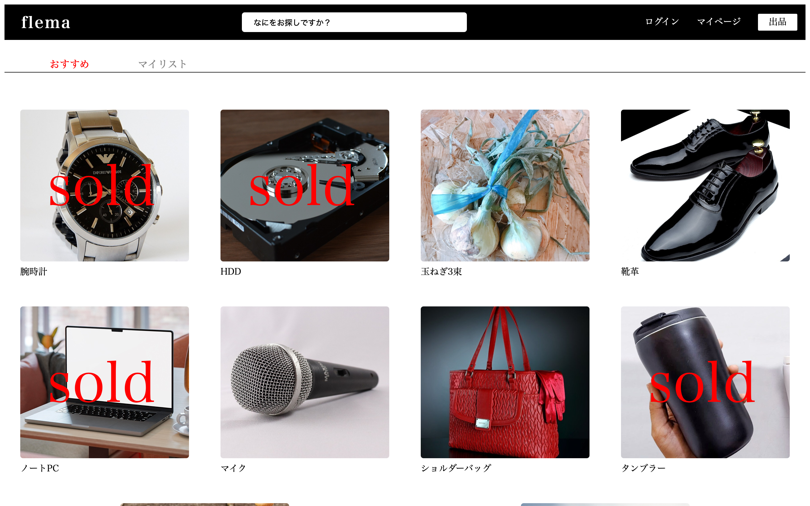
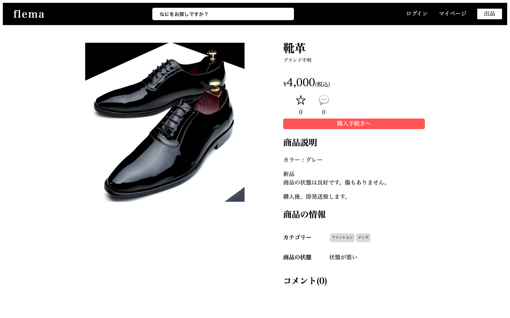
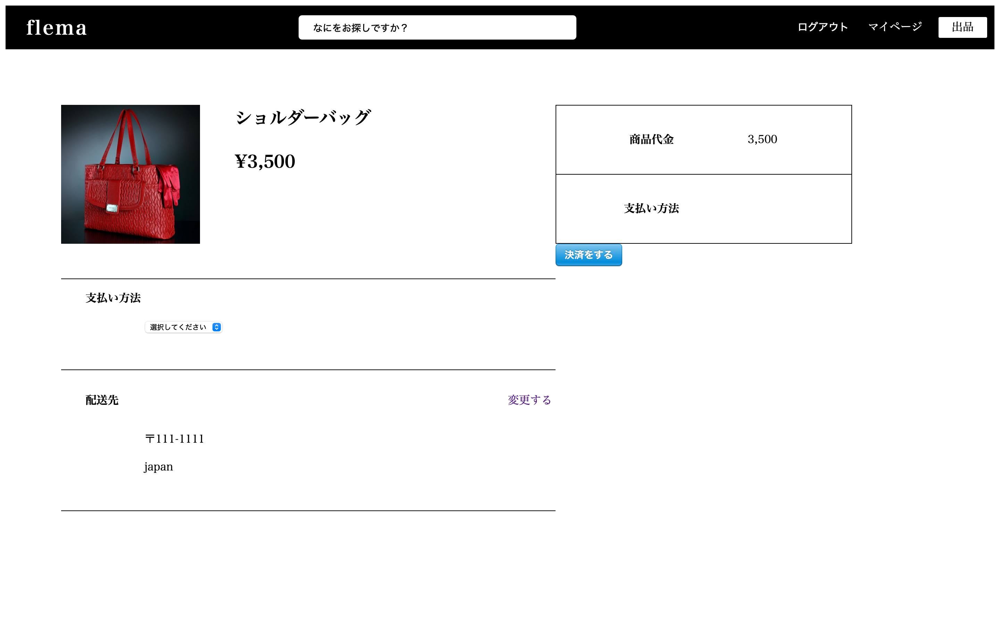
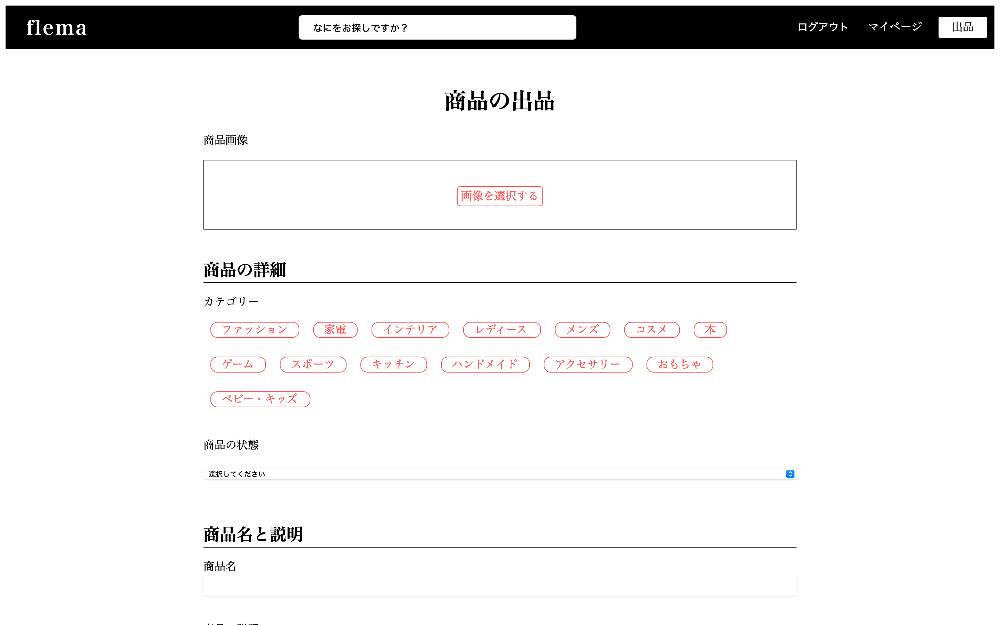
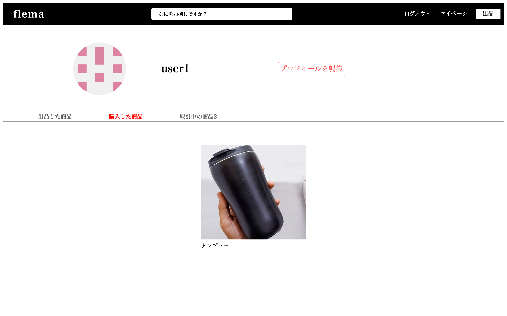
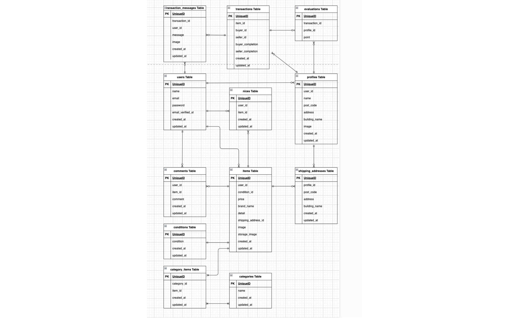

# フリマアプリ flema

## アプリ概要

アイテムの出品・購入ができるフリマアプリです。Stripe による決済、購入後の取引チャット機能を備えています。

## 目次
- [アプリ概要](#アプリ概要)
- [画面イメージ](#画面イメージ)
- [環境構築](#環境構築)
- [使用技術](#使用技術)
- [ER図](#er図)
- [設計・実装のポイント](#設計実装のポイント)
- [URL](#url)

### 主な機能
#### アカウント
- 会員登録(メール認証あり) / ログイン / ログアウト
- プロフィールの編集

#### 購入者としてできること
- 商品一覧の閲覧 / 商品検索
- いいね(マイリスト)
- 商品へのコメント
- 商品の購入(Stripe決済)
- 配送先住所の変更

#### 出品者としてできること
- 商品の出品(画像・カテゴリー・状態の登録)

#### 取引
- 購入後の取引チャット
- マイページで出品・購入・取引中の商品を確認

## 画面イメージ
### 商品一覧画面

### 商品詳細画面

### 購入画面

### 出品画面

### マイページ


## 環境構築

### Dockerビルド

1. git clone git@github.com:hi-san10/flema.git
2. docker-compose up -d --build

*MYSQLは、OSによって起動しない場合があるのでそれぞれのPCに合わせて docker-compose.yml ファイルを編集してください。

### Laravel環境構築

1. docker-compose exec php bash
2. composer install
3. .env.example ファイルから .env を作成し、docker-compose.ymlに応じて環境変数を変更(メール・決済の設定は下記参照)
4. php artisan key:generate
5. php artisan migrate
6. php artisan storage:link
7. php artisan db:seed

#### シーディングされるダミーデータ
- ログイン用ユーザーのダミーデータ3件分
  - name: `user1` / email: `user1@mail.com` / password: `11111111`
  - name: `user2` / email: `user2@mail.com` / password: `22222222`
  - name: `user3` / email: `user3@mail.com` / password: `33333333`
- 各ユーザーのプロフィール・配送先住所データ
- 商品のダミーデータ10件分(カテゴリー14件・状態10件と紐づけ済み)
- 購入済み商品6件分と、それに紐づく取引データ・取引メッセージ

### メール設定(Mailtrap)
開発環境ではMailtrapサービスを使ってメール機能を開発しています。

- Mailtrap url:[https://mailtrap.io](https://mailtrap.io)
- アカウント作成後、ログインする
- 左メニューにある Email Testing リンク、もしくは画面中央あたりの Email Testing の「Start Testing」ボタンをクリック
- SMTP Settings タブをクリック
- Integrations セレクトボックスで、Laravel 7.x,8.x を選択
- copy ボタンをクリックして、クリップボードに .env の情報を保存
- .envにコピーした情報を貼り付ける

```env
MAIL_MAILER=smtp
MAIL_HOST=sandbox.smtp.mailtrap.io
MAIL_PORT=2525
MAIL_USERNAME=your_mailtrap_username   # ← Mailtrap の SMTP Settings の値に置き換え
MAIL_PASSWORD=your_mailtrap_password   # ← Mailtrap の SMTP Settings の値に置き換え
MAIL_ENCRYPTION=tls

MAIL_FROM_ADDRESS=example@example.com
MAIL_FROM_NAME="${APP_NAME}"
```

### 決済設定(Stripe)
- Stripe url:[https://stripe.com/jp](https://stripe.com/jp)
- ユーザー登録を済ませ、ダッシュボードへ
- 画面右上の「テスト環境」にチェックを入れる
- テスト環境の「公開可能キー」と「シークレットキー」をそれぞれ .env に設定する

```env
STRIPE_KEY=pk_test_xxxxx      # ← 公開可能キーに置き換え
STRIPE_SECRET=sk_test_xxxxx   # ← シークレットキーに置き換え
```

- 決済画面では以下のテスト用カード情報を使用
  - カード番号: `4242 4242 4242 4242`
  - 有効期限: 未来の日付(例: `12/30`)
  - セキュリティコード: 任意の3桁

.env を更新したら `php artisan config:clear` を実行してください。

## 使用技術

- PHP 8.3
- Laravel 8.83
- MYSQL 8.0
- Docker / Docker Compose
- Nginx
- Stripe
- AWS(EC2 / S3 / RDS)へのデプロイを経験(現在は停止)

## ER図



## 設計・実装のポイント
- Docker環境を構築し、環境差異なく動作するよう設計
- 決済処理は Stripe を利用し、テスト環境で購入フローを一通り確認できる構成
- 購入後の取引をチャットでやり取りできるよう、取引と取引メッセージをテーブルで分けて管理

## URL

- アプリケーション(開発環境):[http://localhost/](http://localhost/)
- phpMyAdmin(開発環境):[http://localhost:8080](http://localhost:8080)